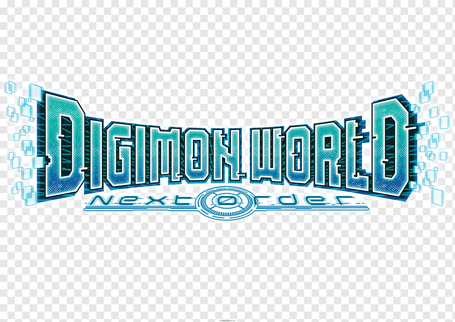

# Digi-World

  

  

  
  
  
   
  
  
  
   
   
   

# o>>> Digi-World  <<<o

  

# Digi-World Documentation
 o> Description
  Digi-World is an Project for managing a collection of car, allowing users to buy, sell, and view details about their car.This documentation provides details on the available endpoints and how to use them.

  

# Getting Started
 To get started with the Digi-World, follow these steps:

# Clone the repository.
 - Install dependencies using npm install(npm i).
 - Set up the database by running migrations with npm run migrate.
 - Start the server with npm start / nodemon in server.
 - Start the client with npm run dev.

o> Install them using `npm install`.
...

  

 # External APIs
o>  Midtrans
Midtrans is integrated to handle payment transactions for Users top-ups. Visit the Midtrans documentation for more information on integrating Midtrans into your project / application. 
   - Visit the [Midtrans documentation](https://docs.midtrans.com) for more information on integrating Midtrans into your application.
  - https://digi-api.com
  ...

  

# Note
I'm really sorry for the project we made, Mokondo it still can't support mobile due to time. Maybe the mobile version is still coming soon

  

# Thanks & have a nice day
....
  

